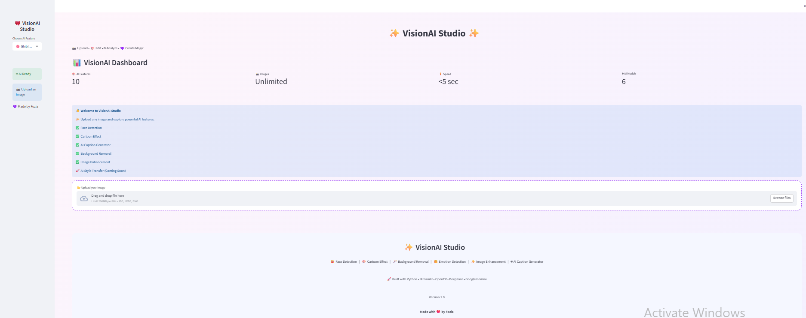

# ✨ VisionAI Studio

An AI-powered photo editing application built with **Computer Vision**, **Deep Learning**, and **Generative AI**. The application provides intelligent image processing features through a modern and interactive Streamlit interface.

---

## 🚀 Features

- 😀 Face Detection using OpenCV
- 😊 Emotion Detection using DeepFace
- 🎨 Cartoon Effect
- ✨ AI Image Enhancement
- 🪄 Background Removal
- 🤖 AI Caption Generator (Google Gemini)
- 📥 Download Processed Images
- 💻 Interactive Streamlit Dashboard

### 🚀 Coming Soon (Version 2.0)

- 🎌 Anime Style Transfer
- 🌸 Studio Ghibli Style
- 🧸 Pixar Style Transformation
- ✏ AI Sketch Generator
- 🎙 AI Talking Avatar
- 🎥 AI Video Generation

---

## 📷 Application Preview

### Dashboard



> Replace this image with your own project screenshot.

---

## 🛠️ Tech Stack

- Python
- Streamlit
- OpenCV
- DeepFace
- Google Gemini API
- Pillow
- NumPy
- Python Dotenv

---

## 📂 Project Structure

```text
VisionAI_Studio/
│
├── app.py
├── requirements.txt
├── README.md
├── .env.example
├── .gitignore
│
├── assets/
├── modules/
│   ├── face_detection.py
│   ├── emotion_detection.py
│   ├── background_remover.py
│   ├── image_enhancer.py
│   ├── cartoon.py
│   └── caption_generator.py
│
├── uploads/
└── outputs/
```

---

## ⚙️ Installation

Clone the repository

```bash
git clone https://github.com/Fozia-tech/visionai-studio.git
```

Go to project directory

```bash
cd visionai-studio
```

Install dependencies

```bash
pip install -r requirements.txt
```

Create a `.env` file

```env
GOOGLE_API_KEY=YOUR_GOOGLE_API_KEY
HF_TOKEN=YOUR_HUGGINGFACE_TOKEN
```

Run the application

```bash
streamlit run app.py
```

---

## 🔑 Environment Variables

Create a `.env` file in the project root.

```env
GOOGLE_API_KEY=YOUR_GOOGLE_API_KEY
HF_TOKEN=YOUR_HUGGINGFACE_TOKEN
```

**Note:** Never upload your `.env` file to GitHub.

---

## 🎯 Future Improvements

- AI Style Transfer
- AI Talking Avatar
- AI Video Generation
- AI Image Restoration
- AI Face Swap
- AI Background Generator

---

## 👩‍💻 Author

**Fozia**

AI & Machine Learning Enthusiast

GitHub: https://github.com/Fozia-tech

---

## ⭐ Support

If you found this project helpful, consider giving it a ⭐ on GitHub.